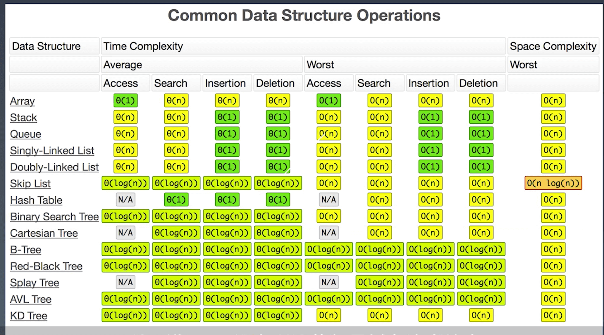
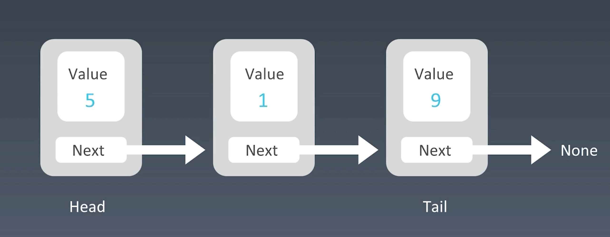

# 第一周学习笔记
## 时间复杂度

## 数组、链表、跳表的基本实现和特性
### Array 数组
* 实现：申请数组，在内存地址中申请一段连续的地址。每个地址都可以通过内存管理器直接访问
* 特性：  
    1. 访问快：时间复杂度O(1)
    2. 增删慢：时间复杂度O(n)

### Linked List 链表
* 实现



```
// js 单向链表实现

class Node {
    constructor(value) {
        this.value = value
        this.next = null
    }
}

class LinkedList {
    constructor(head) {
        this.head = new Node(head);
    }

    find(item) {
        let currNode = this.head;
        while(currNode.value != item) {
            curNode = currNode.next;
        }
        return currNode;
    }
    
    findPrevious(item) {
        let currNode = this.head;
        while(currNode.next.value != item) {
            currNode = currNode.next;
        }
        return currNode;
    }

    insert(newItem, item) {
        let node = this.find(item)
        let newNode = new Node(newItem);
        newNode.next = node.next;
        node.next = newNode;
    }

    remove(item) {
        let preNode = this.findPrevious(item);
        preNode.next = preNode.next.next;
    }
}
```
* 分类
    1. 单链表：只有next指针
    2. 双向链表：有pre或者previous指针和next指针
    3. 循环链表： Tail的指针next指会到Head来

* 特点
    1. 查询慢：时间复杂度O(n)
    2. 增删快：时间复杂度O(1)

* 工程中的应用:LRU Cache  
    <https://www.jianshu.com/p/379b5e0624d4>  
    <https://leetcode-cn.com/problems/lru-cache/>

### Skip List 跳表
*注意：只能用于元素有序的情况。*   
*所以，跳表(skip list)对标的是二叉搜索树中的平衡树(AVL Tree)和二分查找。是一种 插入/删除/搜索都是O(log n)的数据结构*    
*原理简单、容易实现、方便扩展、效率风高。因此在一些热门的项目里用来替代平衡术，如RRedis、LevelDB等*

* 实现： 升维思想(建立多层索引),空间换时间
* 特点：
    1. 查询相对普通链表快： 时间复杂度O(logn)
    2. 增删相对普通链表慢：时间复杂度O(logn)
    3. 空间复杂度 O(n)

* 工程中的应用：Redis

## 栈和队列的实现与特性
### Stack 栈
* 实现： 数组，链表
* 特点：
    1. 先入后出 FILO
    2. 添加、删除皆为O(1)
    3. 查询O(n)

### Queue 队列
* 实现： 数组、链表
* 特点
    1. 先入先出 FIFO
    2. 添加、删除皆为O(1)
    3. 查询O(n)

### Deque 双端队列
* 实现：定义为接口，抽象数据接口，可用数组、链表实现
* 特点
    1. 插入删除O(1)
    2. 查询O(n)

### Priority Queue
* 实现：定义为接口，抽象数据接口，底层具体实现的数据结构较为多样性和复杂：heap、bst、treap
* 特点
    1. 按优先级先出
    2. 插入O(1)
    3. 取出O(logn) - 按照元素的优先级取出