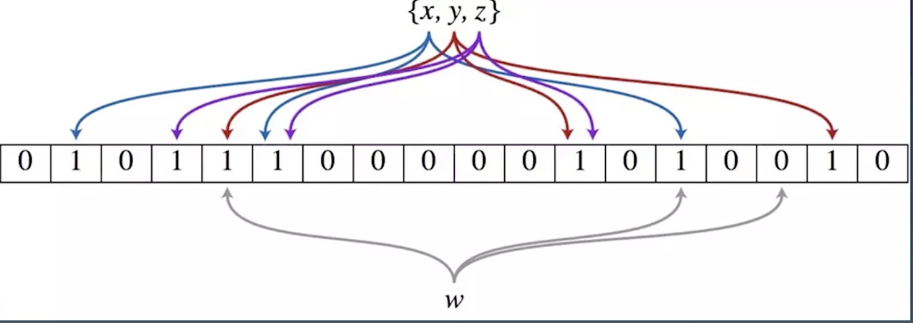

# 第八周学习笔记
## 位运算
### 位运算符
| 含义 | 运算符 | 示例 |
| :------:| :------: | :------ |
| 左移 | << | 0011 => 0110 |
| 右移 | >> | 0110 => 0011 |
| 按位或 | \| | 0011 <br>   ———— =>1001<br>1011 |
| 按位与 | & | 0011<br> ————=> 0011<br>1011 |
| 按位取反 | ~ | 0011 => 1100 |
| 右移 | >> | 0110 => 0011 |
### 算数移位与逻辑移位
### 位运算的应用

## 布隆过滤器
* Bloom Filter vs Hash Table  
    一个很长的二进制向量和一些列随机映射函数。布隆过滤器可以用于检索一个元素是否在一个集合中
* 优点：空间效率和查询时间都远远高于一般的算法
* 缺点：有一定的误识别率和删除困难
* 示意图

* 案例
    1. 比特币网络
    2. 分布式系统(Map-Reduce) —— Hadoop、search engine
    3. Redis缓存
    4. 垃圾邮件、评论等的过滤

## LRU Cache
* Cache 缓存
* 两个要素: 大小， 替换策略
* Hash Table + Double LinkedLIst
* O(1)查询  
  O(1)修改、更新
* 代码实现(js)
```
/**
 * @param {number} capacity
 */
var LRUCache = function(capacity) {
    this.size = capacity
    this.cache = new Map()
};

/** 
 * @param {number} key
 * @return {number}
 */
LRUCache.prototype.get = function(key) {
    if (this.cache.has(key)) {
        const temp = this.cache.get(key)
        this.cache.delete(key)
        this.cache.set(key, temp)
        return temp
    }
    return -1
};

/** 
 * @param {number} key 
 * @param {number} value
 * @return {void}
 */
LRUCache.prototype.put = function(key, value) {
    if(this.cache.has(key)) {
        this.cache.delete(key)
        this.cache.set(key, value)
    } else {
        if (this.cache.size >= this.size) {
            this.cache.delete(this.cache.keys().next().value)
        } 
        this.cache.set(key, value)
    }
    
};

/**
 * Your LRUCache object will be instantiated and called as such:
 * var obj = new LRUCache(capacity)
 * var param_1 = obj.get(key)
 * obj.put(key,value)
 */
```

## 排序
1. 比较类排序
    通过比较来决定元素间的相对排序，由于其时间复杂度不能突破O(nlogn),因此也称为非线性时间比较类排序
2. 非比较类排序
    不通过比较来决定元素间的相对次序，他可以突破基于比较排序的时间下限，以线性时间运行，因此也称为线性时间非比较类排序

* 脑图


### 初级排序
1. 选择排序(Selection Sort)  
    每次找最小值，然后放到待排序数组的起始位置
2. 插入排序(Insertion Sort)  
    从前到后逐步构建有序序列；对于未排序的数据，在已排序序列中从后向前扫描，找到相应位置并插入
3. 冒泡排序(Bubble Sort)  
    嵌套循环，每次查看相邻的元素如果逆序，则交换

### 高级排序
1. 快速排序(Quick Sort)  
    数组取标杆pivot，将小元素放在pivot左边，大元素放在右侧，然后依次对右边和右边的子数组继续快排，以达到整个序列有序
2. 归并排序(Merge Sort) —— 分治
    1. 把长度为n的输入序列分成两个长度为n/2的子序列
    2. 对两个子序列分别采用归并排序
    3. 将两个排序好的子序列合并成一个最终的排序序列
3. 堆排序(Heap Sort)  
    堆插入O(logN),取最大/最小值O(1)
    1. 数组元素依次建立小顶堆
    2. 依次取堆顶元素，并删除

总结： 归并和快排具有相似性，但步骤相反
    归并：先排序左右子数组，然后合并两个有序子数组
    快排：先调配出左右子数组，然后对于左右子数组进行排序

### 特殊排序 - O(n)
* 计数排序(Counting Sort)
* 桶排序(Bucket Sort)
* 基数排序(Radix Sort)